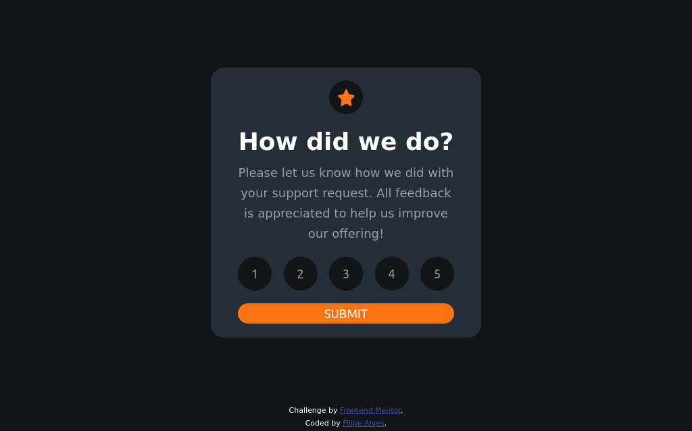

# Frontend Mentor - Interactive rating component solution

Esta é uma solução para o [Interactive rating component challenge on Frontend Mentor](https://www.frontendmentor.io/challenges/interactive-rating-component-koxpeBUmI).Os desafios do Frontend Mentor ajudam você a melhorar suas habilidades de codificação através da construção de projetos realistas.

## Welcome! 👋

## Índice

- [Visão geral](#visão-geral)
  - [O desafio](#o-desafio)
  - [Screenshot](#screenshot)
  - [Links](#links)
- [Meu Processo](#meu-processo)
  - [Construído com](#construído-com)
  - [O que eu aprendi](#o-que-eu-aprendi)
  - [Próximos Passos](#próximos-passos)
- [Author](#author)

## Visão geral

### O desafio

Os usuários devem ser capazes de:

- Veja o layout ideal para o aplicativo dependendo do tamanho da tela do dispositivo
- Veja os estados de foco para todos os elementos interativos na página
- Selecione e envie uma classificação numérica
- Veja o estado do cartão "Thank you" após enviar uma avaliação

### Screenshot



### Links

- Solution URL: [Interactive rating component](https://interactive-rating-component-omega-mauve.vercel.app/)

## Meu Processo

### Construído com

- HTML5 semântica
- CSS custom properties
- Flexbox
- Fluxo de trabalho voltado para dispositivos móveis
- [React](https://reactjs.org/) - JS library

### O que eu aprendi

Meu principal objetivo com esse projeto é particar o desenvolvimeto de web com React, o principal conceito colocado em pratica foi o Context Api, que foi utilizado para gerenciar o estado global de uma aplicação React. Ela permite compartilhar dados (como estado) entre componentes sem a necessidade de passar props manualmente entre eles.

```js
import React, { createContext, useState } from 'react';

// Crie o contexto
const MeuContexto = createContext();

// Crie um provedor que irá encapsular os componentes onde você deseja compartilhar informações
export function MeuContextoProvider({ children }) {
  const [informacao, setInformacao] = useState('Informação inicial');

  return (
    <MeuContexto.Provider value={{ informacao, setInformacao }}>
      {children}
    </MeuContexto.Provider>
  );
}
```

### Próximos Passos

Continuarei estudando ReactJs, e meu próximo objetivo é usar Redux nos projetos.

## Author

- Linkedin - [Filipe Alves](https://www.linkedin.com/in/filipeqalves/)
- Frontend Mentor - [@lipeqalves](https://www.frontendmentor.io/profile/lipeqalves)
