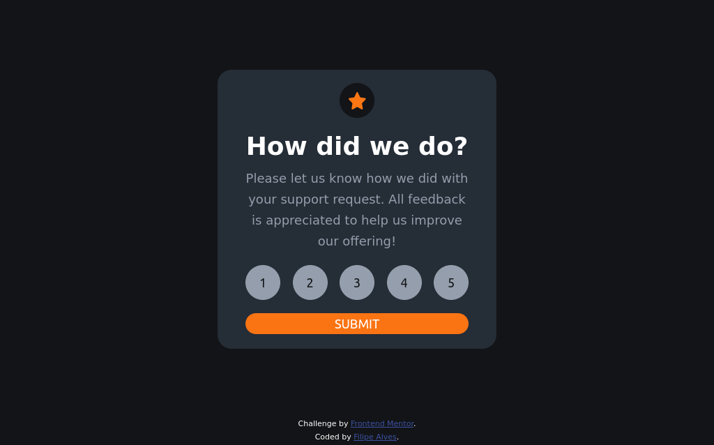
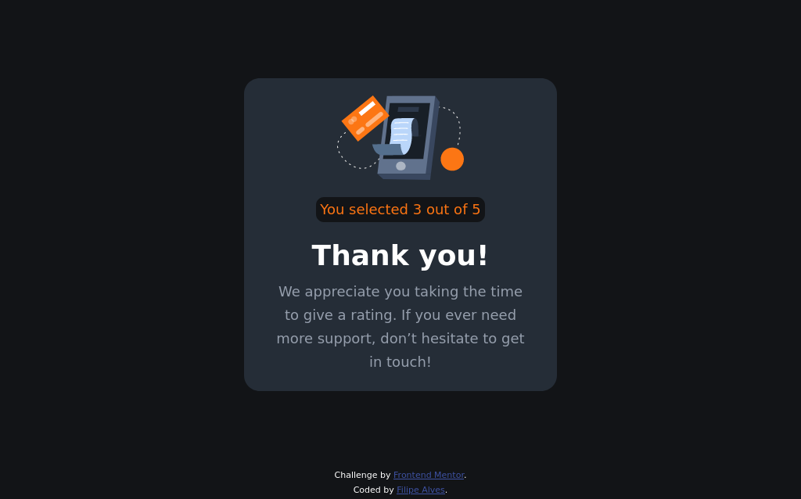

# Welcome! 👋

## Frontend Mentor - Interactive rating component solution

Esta é uma solução para o [Interactive rating component challenge on Frontend Mentor](https://www.frontendmentor.io/challenges/interactive-rating-component-koxpeBUmI). Os desafios do Frontend Mentor ajudam você a melhorar suas habilidades de codificação através da construção de projetos realistas.

### Índice

- [Visão geral](#visão-geral)
  - [O desafio](#o-desafio)
  - [Screenshot](#screenshot)
  - [Links](#links)
- [Desenvolvimento](#desenvolvimento)
  - [Tecnologias](#tecnologias)
  - [Aprendizado](#aprendizado)
  - [Próximos Passos](#próximos-passos)
- [Autor](#autor)

### Visão geral

#### O desafio

O projeto:

- Layout responsivo
- Ter os estados de foco para todos os elementos interativos na página
- Selecionar e enviar uma classificação numérica
- Ter o estado do cartão "Thank you" apos enviar uma avaliação

#### Screenshot





#### Links

- Solution URL: [Interactive rating component](https://interactive-rating-component-omega-mauve.vercel.app/)

### Desenvolvimento

#### Tecnologias

- HTML5 semântica
- CSS
- Flexbox
- Layout Responsivo
- [React](https://reactjs.org/) - JS library

#### Aprendizado

Meu principal objetivo com esse projeto é praticar o desenvolvimento de web com React, o principal conceito colocado em prática foi o Context Api, que foi utilizado para gerenciar o estado global de uma aplicação React. Ela permite compartilhar dados (como estado) entre componentes sem a necessidade de passar props manualmente entre eles.

```js
import React, { createContext, useState } from 'react';

// Crie o contexto
const MeuContexto = createContext();

// Crie um provedor que irá encapsular os componentes onde você deseja compartilhar informações
export function MeuContextoProvider({ children }) {
  const [informacao, setInformacao] = useState('Informação inicial');

  return (
    <MeuContexto.Provider value={{ informacao, setInformacao }}>
      {children}
    </MeuContexto.Provider>
  );
}
```

#### Próximos Passos

Continuarei estudando ReactJs, e meu próximo objetivo é usar Redux nos projetos.

### Autor

- Linkedin - [Filipe Alves](https://www.linkedin.com/in/filipeqalves/)
- Frontend Mentor - [@lipeqalves](https://www.frontendmentor.io/profile/lipeqalves)
